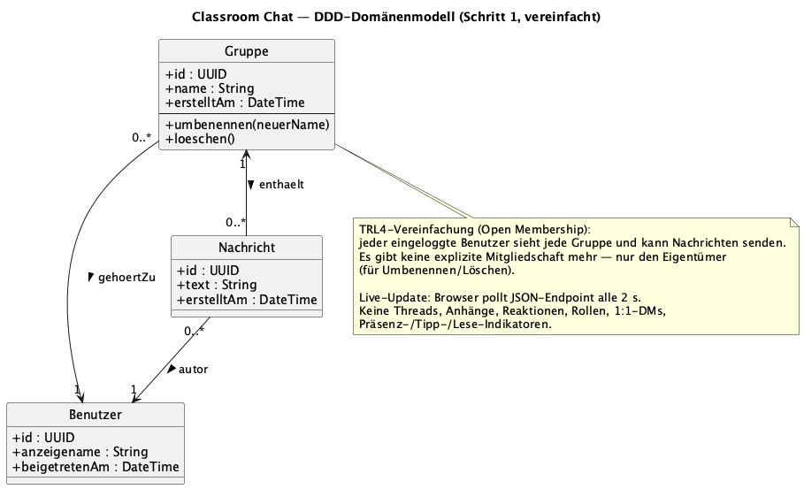
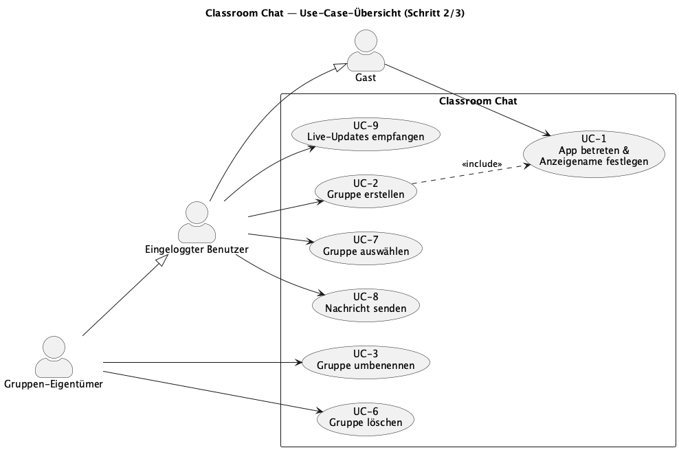

# Schritt 2 — Feature-Katalog (MVP)

Abgeleitet aus dem vereinfachten DDD-Domänenmodell (`Benutzer`, `Gruppe`, `Nachricht`).
Schema pro Feature: **Anwendungsfälle (User Stories nach Cohn) · Geschäftsnutzen · High-Level-Lösungsidee**.

## Übersicht

**Verwandte Artefakte:**

- 📐 Domänenmodell (DDD-Klassendiagramm): [diagrams/domaenenmodell.puml](diagrams/domaenenmodell.puml)
- 🖥️ Interaktives HTML-Mockup: [mockups/index.html](mockups/index.html)

**Domänenmodell:**

**Use-Case-Übersicht** (Detail-Beschreibung siehe [Schritt 3](schritt3-use-cases.md)):

---

## F1 — Identität (Anzeigename)

- **Anwendungsfälle:**
  - Als neuer Benutzer möchte ich beim Öffnen der App einen Anzeigenamen eingeben, damit meine Nachrichten einem wiedererkennbaren Absender zugeordnet werden können.
  - Als wiederkehrender Benutzer möchte ich beim erneuten Aufruf nicht erneut nach meinem Namen gefragt werden, damit ich ohne Reibung weiterchatten kann.
- **Geschäftsnutzen:** Reibungsloser Einstieg ohne Registrierung — Lernende können in Sekunden mitchatten; Nachrichten erhalten einen wiedererkennbaren Autor.
- **Lösungsidee:** Beim ersten `GET /` wird, falls kein `user_id`-Cookie existiert, ein Namensformular angezeigt. `POST /join` legt `(user_id, anzeigename)` im In-Memory-Benutzerspeicher ab und setzt ein signiertes Cookie.

## F2 — Gruppenverwaltung

- **Anwendungsfälle:**
  - Als Benutzer möchte ich eine neue Gruppe erstellen, damit ich für ein Thema oder Team einen eigenen Kanal habe.
  - Als Gruppen-Eigentümer möchte ich meine Gruppe umbenennen, damit der Name den tatsächlichen Zweck widerspiegelt.
  - Als Gruppen-Eigentümer möchte ich Mitglieder hinzufügen oder entfernen, damit nur die richtigen Personen Zugriff auf die Konversation haben.
  - Als Gruppen-Eigentümer möchte ich meine Gruppe löschen, damit nicht mehr genutzte Kanäle die Übersicht nicht belasten.
- **Geschäftsnutzen:** Eine Klasse kann sich ohne Admin selbst in Themen-/Team-Kanäle organisieren.
- **Lösungsidee:** In-Memory-`gruppen`-Dict mit Schlüssel `group_id` und Inhalt `{name, owner_id, mitglieder:set}`. Routen: `POST /groups`, `POST /groups/<id>/members`, `DELETE /groups/<id>/members/<uid>`, `DELETE /groups/<id>`. Server-seitige Prüfung: nur `owner_id == current_user`.

## F3 — Mitgliedschaft & Navigation

- **Anwendungsfälle:**
  - Als Mitglied möchte ich eine Liste meiner Gruppen sehen, damit ich schnell den Überblick über meine Konversationen habe.
  - Als Mitglied möchte ich zwischen meinen Gruppen wechseln können, damit ich gezielt die Nachrichten der gerade relevanten Gruppe lesen kann.
- **Geschäftsnutzen:** Klare Trennung der Konversationen; Mitglieder sehen nur, was für sie relevant ist.
- **Lösungsidee:** `GET /` rendert eine Seitenleiste aus `gruppen`, gefiltert nach Mitgliedschaft. Die aktive Gruppe ist ein Pfadparameter `/g/<id>`. Server-seitig gerenderte HTML-Seiten, vollständiger Reload — kein JS-Framework für TRL4 nötig.

## F4 — Nachricht senden

- **Anwendungsfälle:**
  - Als Mitglied einer Gruppe möchte ich eine Textnachricht schreiben und absenden, damit ich mit den anderen Mitgliedern kommunizieren kann.
  - Als Mitglied möchte ich neben jeder Nachricht den Autor und den Zeitstempel sehen, damit ich den Verlauf der Konversation nachvollziehen kann.
- **Geschäftsnutzen:** Kernfunktion des Produkts — ermöglicht Konversation.
- **Lösungsidee:** `POST /g/<id>/messages` mit Formularfeld `text`. Anhängen an die In-Memory-Liste `nachrichten[group_id]`. Redirect zurück auf `/g/<id>` (Post-Redirect-Get).

---

## Bewusst nicht im MVP

- Antworten / Threads
- Automatische Aktualisierung des Feeds (Auto-Refresh)
- Bearbeiten / Löschen eigener Nachrichten
- Anhänge, Reaktionen, Rollen, 1:1-DMs, Präsenz-/Tipp-/Lese-Indikatoren
